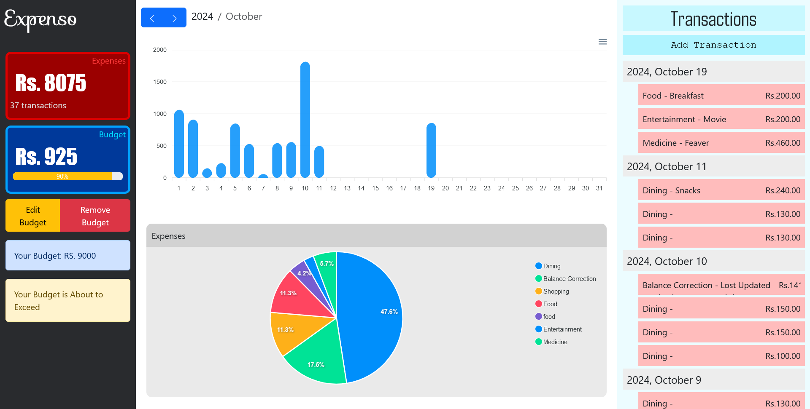
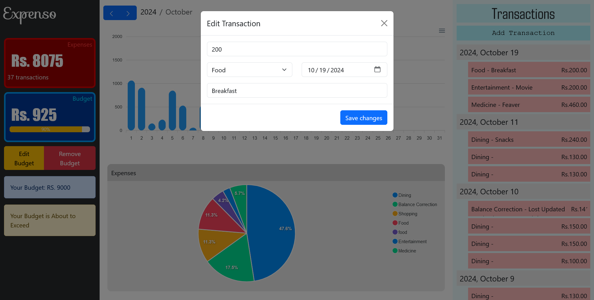

# Clone with submodules

```
git clone --recurse-submodules https://github.com/thisarasamuditha/iwb210-hashmap
```

# Start App

> [Docker](https://www.docker.com/) is required to run this applicaion.

```
cd iwb210-hashmap

docker compose up --build
```

> When composing, after the images are built it might take 1-2 minutes for the containers to be fully awake.

> visit localhost:4000 to access the web app

> webapp is not mobile responsive

# Stop App

```
docker compose down
```

## On slow connections

> build backend seperately

```
docker build backend
```

then run;

```
docker compose up
```

# Screenshots




